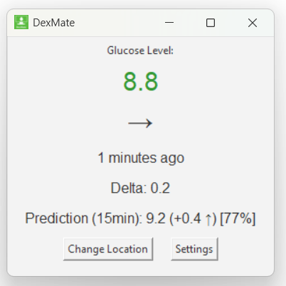

# DexMate

DexMate is a lightweight desktop widget for Dexcom users, providing real-time glucose data directly on your desktop.

It works on Windows, macOS, and Linux, with a clean and customizable interface designed to stay simple and useful.

## Preview



## Features

- Cross-platform support for Windows, macOS, and Linux
- Real-time glucose data, trend and delta
- Lightweight and intuitive design
- Customizable settings
- Alerts and notifications
- Nightscout integration
- Glucose prediction

Learn more at [dex-mate.com](https://dex-mate.com)

## Download

Visit the official website for downloads and more information:  
[https://dex-mate.com/](https://dex-mate.com/)

## Development

To work with the source code:

```bash
git clone https://github.com/rpimaster/DexMate.git
cd DexMate
```

## Contributing

DexMate is an open-source project, and contributions are welcome.

If you'd like to contribute:
1. Fork the repository
2. Create a new branch
3. Make your changes
4. Test everything properly
5. Open a pull request with a clear description

## Important

DexMate is an open-source community project and is not a medical device.  
Do not rely on it as your only source of glucose information or treatment decisions.

## Contact

For questions, feedback, or support:  
[dexmate.contact@gmail.com](mailto:dexmate.contact@gmail.com)
